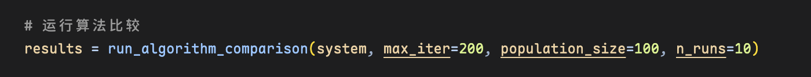
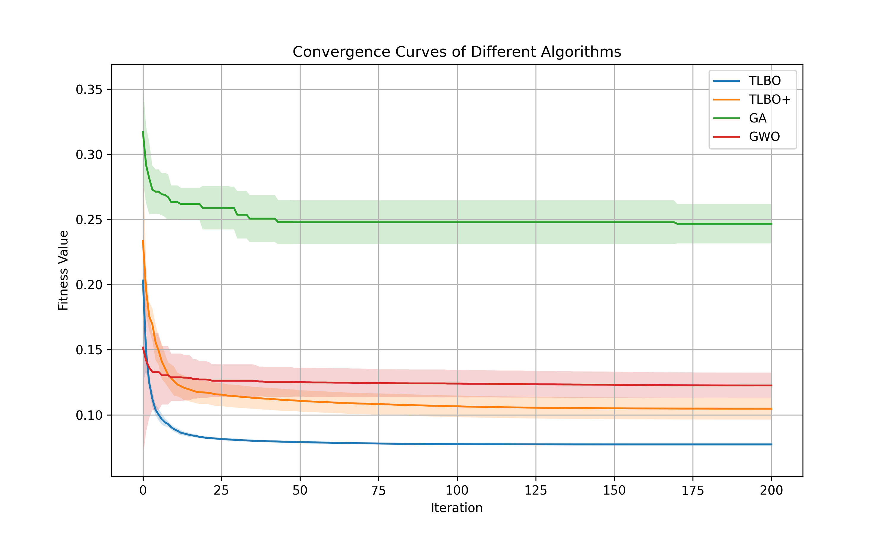
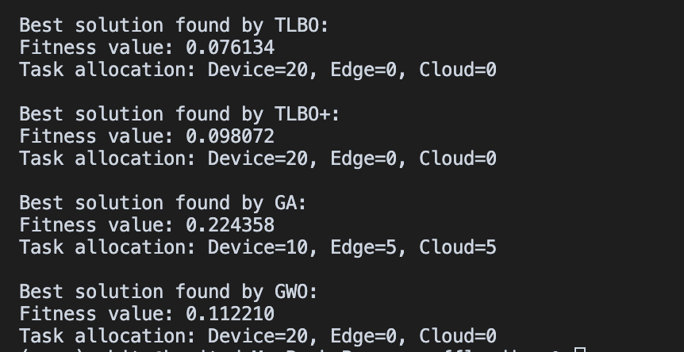
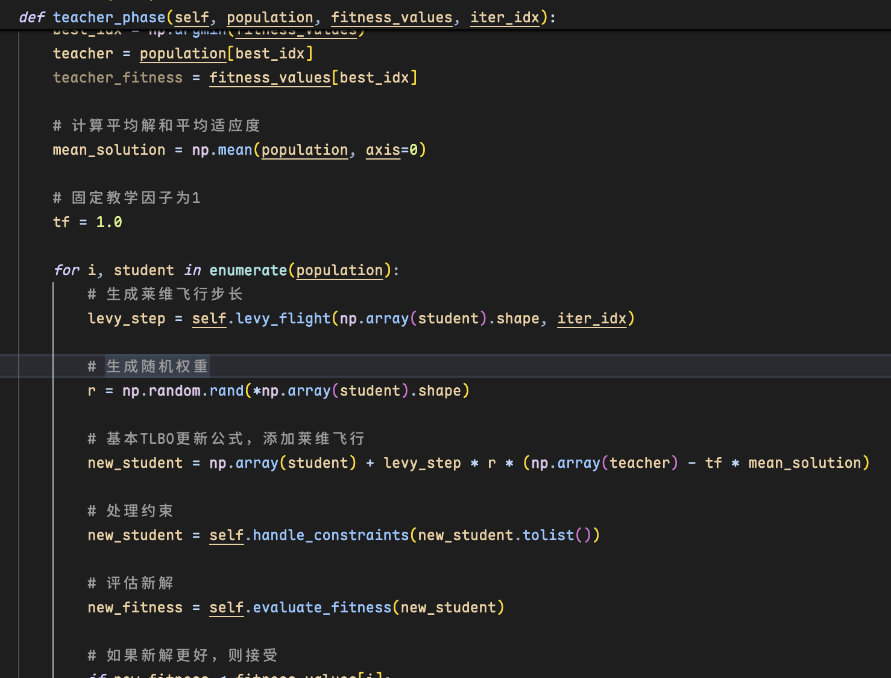
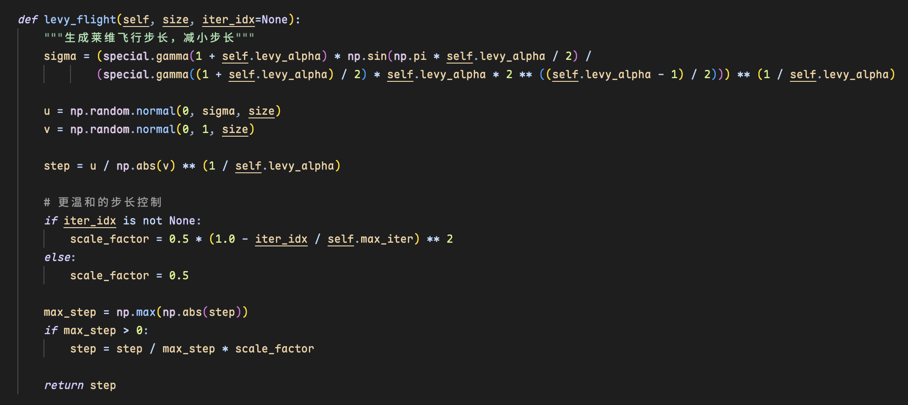
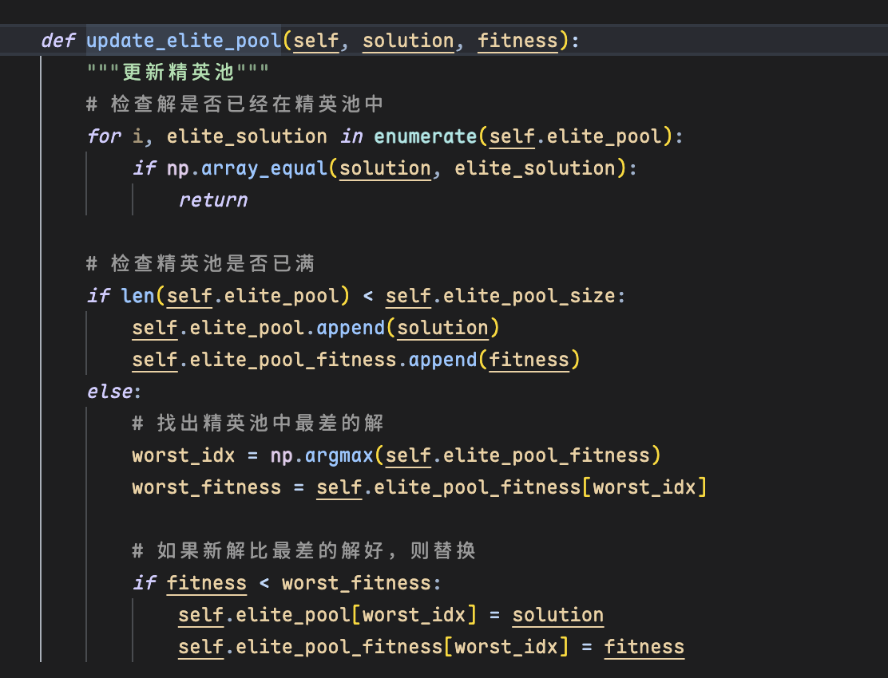

# 1. 算法比较实验 (Part 1 - 无 AoI )

本部分实验旨在评估和比较不同优化算法在解决 MEC 任务卸载问题（仅考虑能耗和延迟）时的性能，基于更新后的实验参数。

### 1.1 实验设置 

实验中使用的系统环境具体配置如下：

- **设备数量**: 10 个
- **边缘服务器数量**: 5 个
- **云服务器数量**: 2 个
- **任务数量**: 20 个
- **系统参数**: 设备的 CPU 频率、能耗系数、传输功率，服务器的 CPU 频率、能耗系数，任务的数据大小、计算复杂度、到达率、优先级、最大延迟，以及设备与服务器之间的传输速率和带宽均在预定范围内随机生成。
- **优化目标**: 最小化系统总成本（能耗和延迟的加权和）。
- **对比算法**:

  - TLBO
  - TLBO+
  - GA
  - GWO
- **实验运行**: 每种算法独立运行 10 次 (`n_runs=10`)，每次迭代 200 次 (`max_iter=200`)，种群大小为 100 (`population_size=100`)。

  

### 1.2 实验结果分析 

#### 1.2.1 收敛性能

***按照理论来说TLBO+效果应该比原始的TLBO效果要好，但是目前并没有实现更好的效果，还在找原因，算是目前最大问题***

下图展示了四种算法在 10 次运行中的平均适应度值收敛曲线，阴影部分表示标准差范围。

*图 1: 不同算法的收敛曲线比较 (max_iter=200, population_size=100)*

从图 1 可以看出：

- **TLBO**: 依然表现出最快的收敛速度，并且在大约 50 次迭代后就收敛到了最低的平均适应度值。其稳定性（标准差范围）也较好。
- **TLBO+**: 收敛速度和最终结果次于 TLBO，但优于 GWO 和 GA。
- **GWO**: 收敛速度和最终结果介于 TLBO+ 和 GA 之间。
- **GA**: 收敛速度最慢，且最终收敛的适应度值显著高于其他三种算法，表明其在此问题和参数设置下的性能仍然较差。

#### 1.2.2 最优解性能

下表总结了每种算法在 10 次运行中找到的最佳适应度值：

| 算法  | 最佳适应度值 |
| :---- | :----------- |
| TLBO  | 0.076134     |
| TLBO+ | 0.098072     |
| GA    | 0.224358     |
| GWO   | 0.112210     |

*表 1: 不同算法找到的最佳适应度值 (max_iter=200, population_size=100)*

结果表明，TLBO 找到了最优的解（最低适应度值）。GWO 的表现优于上次实验，但仍不如 TLBO 和 TLBO+。GA 的表现最差。

#### 1.2.3 任务分配策略

根据脚本的输出，各种算法找到的最佳解对应的任务分配策略如下：

- **TLBO**: 所有 20 个任务都在**设备本地**执行。
- **TLBO+**: 所有 20 个任务都在**设备本地**执行。
- **GA**: 10 个任务在设备本地执行，5 个任务卸载到**边缘服务器**，5 个任务卸载到**云服务器**。
- **GWO**: 所有 20 个任务都在**设备本地**执行。

**分析**:

- 与上次实验类似，TLBO、TLBO+ 和 GWO 均倾向于将所有任务保留在本地设备执行。这进一步印证了在本次实验随机生成的参数下，本地执行是最小化能耗和延迟组合成本的最优策略。
- GA 再次给出了不同的分配策略，将任务分散到了边缘和云端。结合其最差的适应度值，这表明 GA 在此规模的问题上更难找到全局最优解。

### 1.3 TLBO 与 TLBO+ 对比分析

在本次实验中，基础的 TLBO 算法表现优于改进后的 TLBO+ 算法（适应度值 0.076 vs 0.098）。***这与预期 TLBO+ 会有更好性能的目标不符。***

TLBO+ 在 TLBO的基础上主要引入了以下优化策略：

1. **Levy 飞行**: 在教师阶段 引入了 Levy 飞行机制 ，旨在增强算法的全局搜索能力，跳出局部最优。

   

   
2. **改进的学习者阶段**: 修改了学习者阶段 的更新方式，可能引入了不同的学习因子或策略。
3. **精英策略**: 可能包含精英保留机制或精英池，用于保存和利用历史上找到的较优解。

   

尽管加入了这些旨在提升性能的策略，但在当前的参数设置和问题实例下，TLBO+ 的表现并未超越基础 TLBO。这可能是由于 Levy 飞行的参数（如 `levy_alpha`）或步长缩放因子需要进一步调整，或者精英策略的引入方式干扰了算法的正常收敛。需要在后续工作中对 TLBO+ 的参数和策略进行更细致的调整和测试。

### 1.4 结论 与后续工作

在本次更大规模（更多设备、服务器和任务）和更长迭代次数的实验中：

1. **TLBO 算法** 再次证明了其在当前 MEC 卸载问题模型下的有效性和稳定性，收敛速度快且解的质量最高。
2. **TLBO+ 算法** 虽然优于 GA 和 GWO，但未能超越基础 TLBO，表明其改进策略（如 Levy 飞行）需要进一步的参数调优或机制完善。
3. **GWO 算法** 表现尚可，优于 GA。
4. **GA 算法** 在此问题上的性能相对最差。
5. **任务分配** 结果再次显示，在当前随机生成的系统参数下，本地执行是成本最低的选择。

**后续工作应重点关注 TLBO+ 算法的调试和优化，探索使其改进策略发挥预期效果的参数配置。同时，可以考虑设计传输成本相对较低或任务计算量更大的场景，以观察卸载到边缘或云端是否会成为更优的选择。**

**目前虽然实验还没有达到预期，但我想着先开始文章初稿书写，边写边修改实验，并且归纳公式推导**

---
