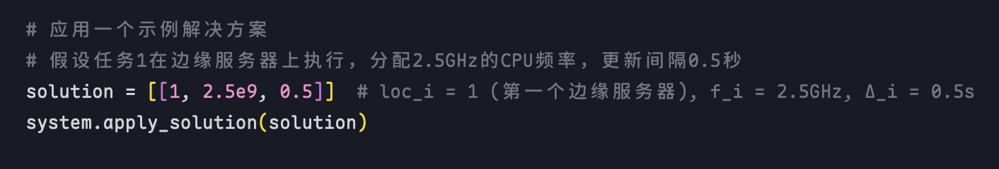
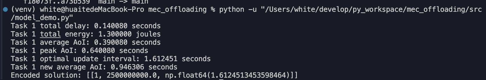
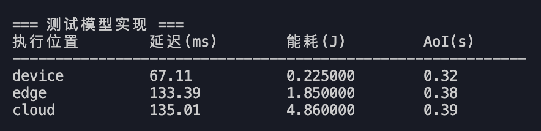
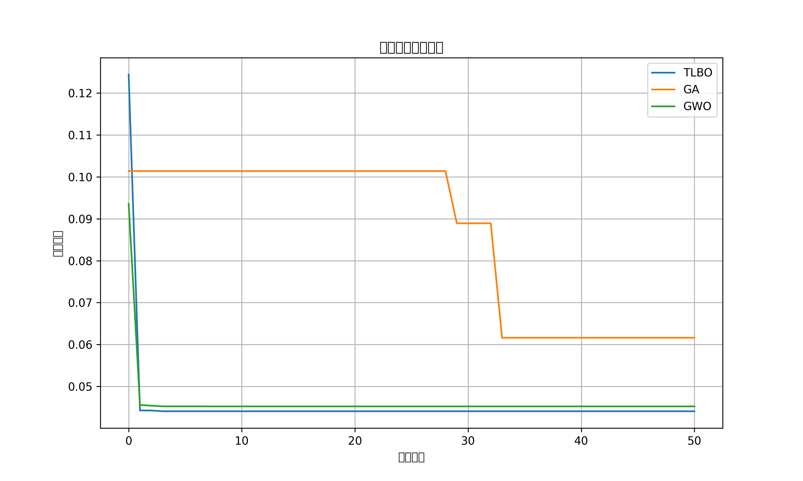
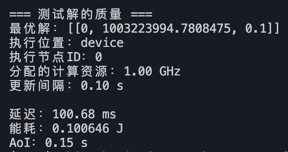

## 1. 系统模型

基于之前的建模，已实现编码工作，并且验证的模型的可行性。

简单的实验设置：

- 系统配置 ：
  - 1个终端设备（2.0 GHz CPU）
  - 1个边缘服务器（3.0 GHz CPU）
  - 1个云服务器（4.0 GHz CPU）
- 任务特性 （假设只有一个任务）：
  - 数据大小：1MB
  - 计算复杂度：100 cycles/bit
  - 到达率：0.1 tasks/s
- 网络参数 ：
  - 设备到边缘服务器：10 Mbps
  - 边缘服务器到云服务器：100 Mbps
- 解决方案 ：
  - 执行位置：边缘服务器
  - 分配的计算资源：2.5 GHz
  - 初始更新间隔：0.5 秒
- 

验证结果：

结果解释：

在当前这个假设的状态下：

- 延迟分析 ：
  - 总延迟：0.140080秒（140.08毫秒）
  - 这包括数据传输延迟和任务执行延迟
- 能耗分析 ：
  - 总能耗：1.300000焦耳
  - 这包括通信能耗和计算能耗
- 信息新鲜度(AoI)分析 ：
  - 平均AoI：0.390080秒
  - 峰值AoI：0.640080秒
  - 优化后的更新间隔：1.612451秒
  - 优化后的平均AoI：0.946306秒

可以看到在当前这个假设的模型里，

- 系统自动将更新间隔从初始的0.5秒优化到了1.61秒，这表明在当前系统配置下，过于频繁的更新并不总是最优的
- 优化后的平均AoI增加到了0.95秒，但仍在可接受范围内（小于最大AoI 1.5秒），这种权衡可能有助于减少系统资源消耗和网络拥塞

## 2. 优化算法

代码实现了用于快速验证算法的脚本。目前只是实现并比较以下三种元启发式优化算法：

### 2.1 TLBO (Teaching-Learning-Based Optimization)

- 基于教学过程的优化算法
- 包含教师阶段和学习者阶段
- 无需特定参数调整

### 2.2 GA (Genetic Algorithm)

- 基于自然选择和遗传机制
- 包含选择、交叉和变异操作
- 需要调整交叉率和变异率

### 2.3 GWO (Grey Wolf Optimizer)

- 模拟灰狼的社会层级和狩猎行为
- 包含α、β、δ和ω四种角色
- 通过位置更新实现搜索和优化

## 3. 测试脚本实验设计与结果分析

### 3.1 实验设置

我们构建了一个简单的测系统，包含：

- 1个终端设备 (1.5 GHz CPU)
- 1个边缘服务器 (3.0 GHz CPU)
- 1个云服务器 (4.0 GHz CPU)
- 1个计算任务 (1MB数据量，100 cycles/bit)

优化目标权重设置：

- 能耗权重：0.5
- 延迟权重：0.3
- AoI权重：0.2

### 3.2 基础模型测试结果

不同执行位置的性能比较：

观察结果：在本测试系统中，本地执行在所有指标上都优于卸载到边缘或云端。这可能是因为任务数据量较小，计算复杂度适中，网络传输开销大于本地计算开销。

### 3.3 算法性能比较

三种算法的性能比较：

观察结果：

- TLBO算法获得最低的适应度值，表明找到了最优解，但运行时间略长
- GWO算法性能次之，运行时间较短
- GA算法性能最差，但运行时间较短

  

从收敛曲线可以看出：

1. TLBO算法在早期迭代中就迅速收敛到最优解
2. GWO算法也较快收敛，但最终解略差于TLBO
3. GA算法收敛较慢，且最终解质量不如其他两种算法

### 3.4 最优解分析

使用TLBO算法得到的最优解：

解析：

- 最优决策是在本地设备执行任务
- 分配的计算资源为1.00 GHz（低于设备最大频率1.5 GHz）
- 更新间隔设置为最小值0.1秒，以保持信息新鲜度
- 这种配置在能耗、延迟和AoI之间取得了良好的平衡

## 4. 已完成与待完成

### 4.1 主要发现

1. **算法性能**：TLBO算法在本研究场景中表现最佳，能够找到更优的任务卸载决策
2. **卸载决策**：对于小型计算任务，本地执行可能比卸载更有效
3. **资源分配**：最优解并不总是使用最大计算资源，而是根据多目标权衡选择合适的资源分配
4. **AoI考虑**：考虑AoI后，系统倾向于选择更短的更新间隔，以保持信息新鲜度

### 4.2待完成

1. **算法改进**：进一步优化TLBO+算法，加入levy飞行策略，并且完成多目标TLBO算法，提高其在多目标优化问题上的性能
2. **场景扩展**：需在后续真实实验中配置更复杂系统模型和更多的任务场景
3. **动态适应**：研究在网络条件动态变化时的自适应卸载策略
4. **不确定性处理**：考虑网络延迟和计算时间的不确定性

### 4.3 问题

之前的测试脚本有一定的随机性，目前实现的简单的系统建模环境里gwo最后的结果可能会比tlbo好

配置复杂系统环境后目前有些bug还没有解决，还在调试
