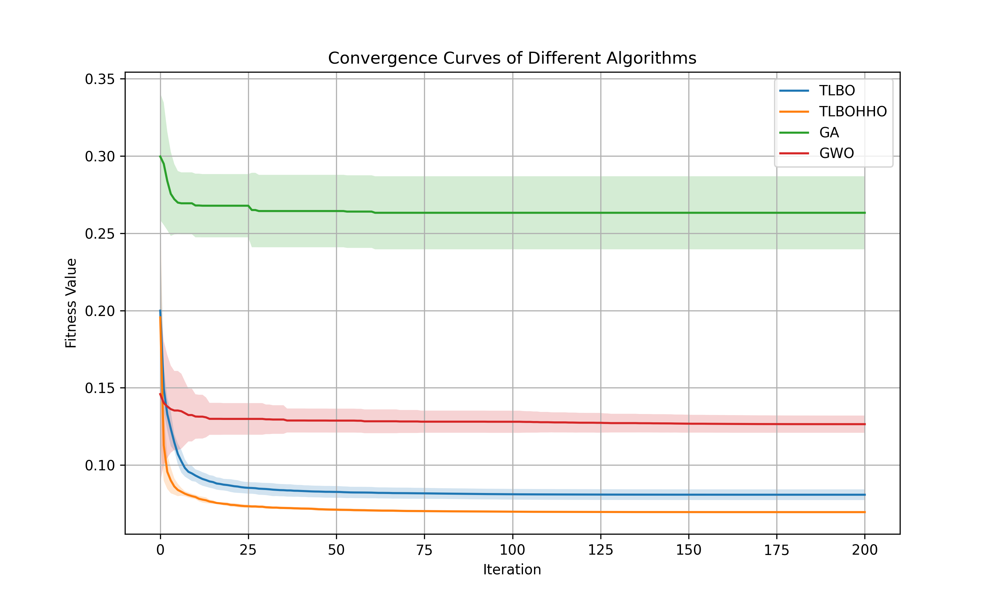
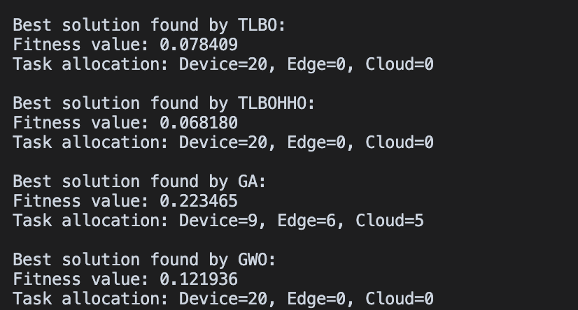
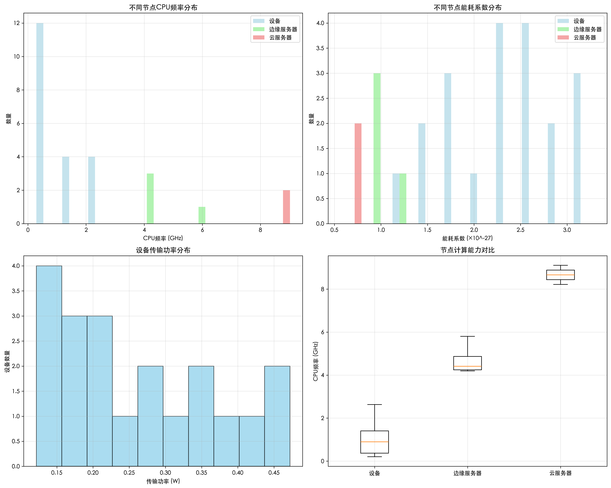
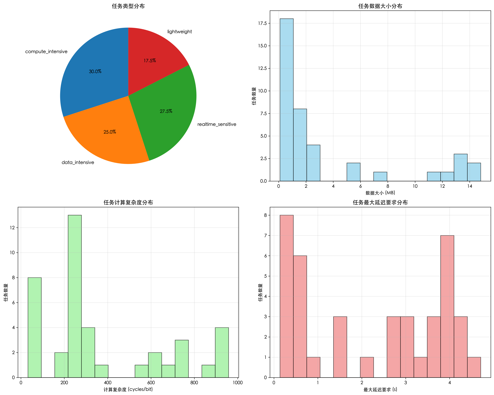
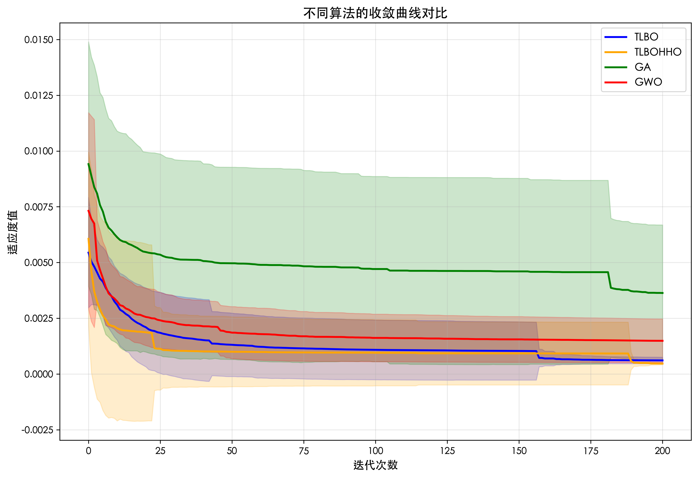
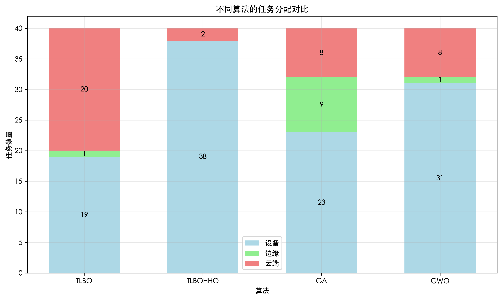
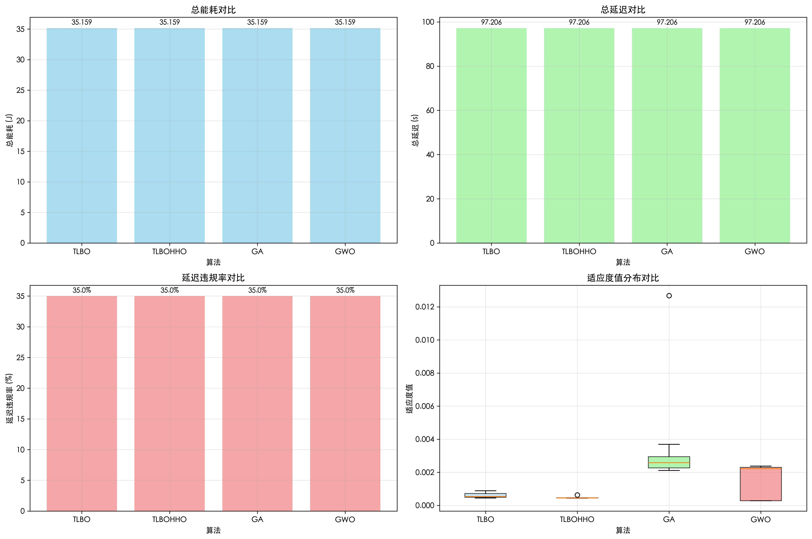

在之前的实验环境中，修改了算法在tlbo中加入了hho，混合后效果良好，但得到的结果比较单一

#### 1. TLBOHHO 算法简介

本次实验引入并测试了一种新的混合优化算法—— **TLBOHHO** 。

* **基本构成** : TLBOHHO 算法结合了教学优化算法 (Teaching-Learning-Based Optimization, TLBO) 和哈里斯鹰优化算法 (Harris Hawks Optimization, HHO) 的思想。
* **TLBO (教学优化算法)** : 是一种模拟教学过程的元启发式算法，包含“教师阶段”（优秀个体指导种群学习）和“学习者阶段”（个体间相互学习）。
* **HHO (哈里斯鹰优化算法)** : 是一种模仿哈里斯鹰群体协作狩猎行为的元启发式算法。它通过模拟哈里斯鹰在不同阶段（探索、包围、攻击猎物）的策略来更新种群位置，以寻找最优解。HHO 算法通常包含探索阶段（基于随机选择的鹰或平均位置进行搜索）和多种基于猎物逃逸能量的开发策略。
* **混合目的** : 将 TLBO 和 HHO 结合的目的是利用 TLBO 算法在利用（exploitation）方面的优势和 HHO 算法在探索（exploration）方面的潜力，或者通过它们机制的互补，期望在求解复杂优化问题时能达到更好的收敛速度和解的质量，避免陷入局部最优。

目前，TLBOHHO 算法在实验中展现出有竞争力的性能，后续可以进一步对其混合策略和参数进行深入研究和优化。

可以看到所有的任务都在终端设备上运行，这是个问题。

所以后续修改了系统建模，

## **后续进展：**

#### 1.Realistic System Modeling (现实系统建模)

为更贴近实际应用场景，构建了名为 `realistic_system_setup` 的系统环境，并在其上进行了 `complete_realistic_experiment` 综合实验。

与之前的建模相比：

1. **参数生成的真实性和细致度差异** ：

* 参数设定上更为精细和贴近现实。
  * **节点能力分层** ：不同类型的计算节点（用户设备、边缘服务器、云服务器）其能力参数不再是简单的在同一水平线上随机，而是体现出明显的层次性。例如，云服务器的CPU频率通常会显著高于边缘服务器，而边缘服务器又高于用户设备。并且，在同一类型的节点内部，其能力也可能遵循特定的分布，而不仅仅是均匀分布。
  * **任务特性多样化与关联性** ：最核心的改进是引入了“任务类型”的概念，例如计算密集型、数据密集型、实时敏感型、轻量型等。这意味着任务的各项具体参数（数据大小、计算需求、延迟容忍度）是根据其所属的“类型”来生成的。例如，“数据密集型”任务自然会有较大的数据量，而“计算密集型”任务则需要更多的计算周期。这种基于类型的参数生成方式，使得任务组合更加多样化且符合实际应用场景的特点，而不是所有任务参数都在一个统一的随机范围内产生。
  * 如图：
  * 

#### 2. 实验结果图像分析

基于上述现实系统模型，我们运行了包括 TLBO、新的 TLBOHHO、GA 和 GWO 在内的多种优化算法，主要结果图像分析如下：

* **收敛曲线对比**:
* 此图展示了不同算法在迭代过程中的适应度值收敛情况。可以看到 TLBO 和 TLBOHHO 算法在早期迭代中能较快收敛到较低的适应度值，表现出较好的收敛速度和寻优能力。GA 算法收敛相对较慢，而 GWO 算法的收敛性能介于两者之间。
* **不同算法的任务分配对比**:
* 此图显示了各算法最终确定的任务分配策略，即多少任务在设备本地执行、多少卸载到边缘服务器、多少卸载到云服务器。
* 从图中可见，TLBO 和 TLBOHHO 倾向于将大部分任务保留在设备本地或卸载到边缘，较少使用云端。GA 的分配策略则更为分散。GWO 的策略也显示出一定的集中性。这种差异反映了不同算法在复杂决策空间中的搜索偏好。
* **性能指标对比**:
* **总能耗与总延迟** : 各算法在总能耗和总延迟方面的表现相近，这可能意味着在当前系统配置和权重下，这些算法都能找到能耗和延迟相对平衡的解。
* **延迟违规率** : 此指标衡量了超出最大延迟要求的任务比例。所有算法都将延迟违规率控制在较低水平。
* **适应度值分布** : 通过箱形图展示了多次运行后各算法获得的最优适应度值的分布情况。TLBO 和 TLBOHHO 的适应度值较低且分布较为集中，表明其解的质量较高且稳定性较好。
